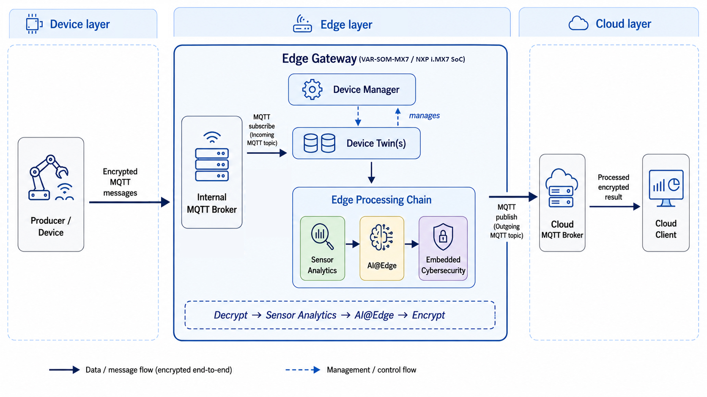

# Performance Evaluation of an IIoT Gateway on the VAR-SOM-MX7 Platform

This repository contains the implementation, experiment automation, and data-analysis scripts used to evaluate an IIoT edge-processing gateway deployed on the VAR-SOM-MX7 Platform

The automated workflow ensures consistent configuration, execution order, message counts, result collection, and repetition.

```text
Decrypt → Sensor Analytics → AI@Edge → Encrypt
```

## Experimental Modes

| Property | Measurement | Deployment |
|---|---|---|
| Main goal | Stage-level Gateway latency | Complete-system performance |
| Workload | Safe publishing interval | Near-saturation interval |
| Stage timing | Yes | No |
| Clock | `time.perf_counter_ns()` | `time.time_ns()` |
| Timestamp hosts | Gateway only | Producer, Gateway, Consumer |
| Main output | `measurement_raw.csv` | Three timestamp CSV files |
| Primary KPI | Stage and total latency | Consumer throughput and Gateway latency |

The full-factorial experiment combines:

- Sensor Analytics: Pure Python or NumPy
- AI: TFLite CPU or EdgeTPU
- Cryptography: PyCryptodome, OpenSSL, or OP-TEE

Each of the 12 combinations is executed three times. Each run contains 50 warm-up messages followed by 1,000 steady-state messages.

## System Architecture



- **Device layer:** Producer publishes encrypted sensor messages.
- **Edge layer:** NXP i.MX7 Gateway executes the Edge Processing Chain.
- **Cloud layer:** Cloud Consumer receives the processed encrypted result.

MQTT communication uses mTLS.

## Quick Start

### Producer

```bash
python producer_runner.py --config producer_local_config.json
```

### Consumer

```bash
python3 cloud_client_runner.py --config cloud_local_config.json
```

### Gateway — Measurement

```bash
cd gateway
python3 automation.py --config-dir ../configs/final_measurement --pattern "*.json" --continue-on-error
```

### Gateway — Deployment

```bash
cd gateway
python3 automation.py --config-dir ../configs/final_deployment --pattern "*.json" --continue-on-error
```

For each experiment, the Gateway becomes ready before the Producer begins publishing.

## Experiment Workflow

```text
1. Start the Producer and Consumer runners.
2. Start automation.py on the Gateway.
3. The automation selects an experiment and launches main.py.
4. The Gateway initializes the selected backends and signals readiness.
5. The Consumer becomes ready, and the Producer begins publishing.
6. Timing records remain in RAM while messages are processed.
7. Results are written after completion and the next run starts.
```

See [docs/AUTOMATION_WORKFLOW.md](docs/AUTOMATION_WORKFLOW.md).

## Repository Components

| Component | Responsibility |
|---|---|
| `gateway/` | Gateway application, automation, Edge Processing Chain, and resource monitoring |
| `producer/` | Generates and publishes encrypted experiment messages |
| `consumer/` | Receives processed messages and records Deployment timestamps |
| `configs/` | Defines Measurement and Deployment runs |
| `model_artifacts/` | Contains normalization parameters and AI models |
| `analysis/` | Calculates latency, throughput, loss, CPU, and RAM statistics |
| `docs/` | Detailed methodology and implementation documentation |

## Results and Analysis

### Measurement

```bash
python analysis/analyze_measurement.py --gateway-results "addr_gateway_results" --output "analysis_output/measurement"
```

Measurement analysis uses Gateway-side files only. No Producer-side or Consumer-side timestamp files are generated.

### Deployment

```bash
python analysis/analyze_deployment.py --gateway-results "addr_gateway_results" --producer-results "addr_producer_results" --consumer-results "addr_consumer_results" --output "analysis_output/deployment"
```

Deployment analysis matches the three timestamp files using `experiment_id` and `seq_id`.

See [docs/DATA_ANALYSIS.md](docs/DATA_ANALYSIS.md).

## Detailed Documentation

- [Experimental Method](docs/EXPERIMENTAL_METHOD.md)
- [Automation Workflow](docs/AUTOMATION_WORKFLOW.md)
- [Data Analysis](docs/DATA_ANALYSIS.md)
- [Implementation Notes](docs/IMPLEMENTATION_NOTES.md)
